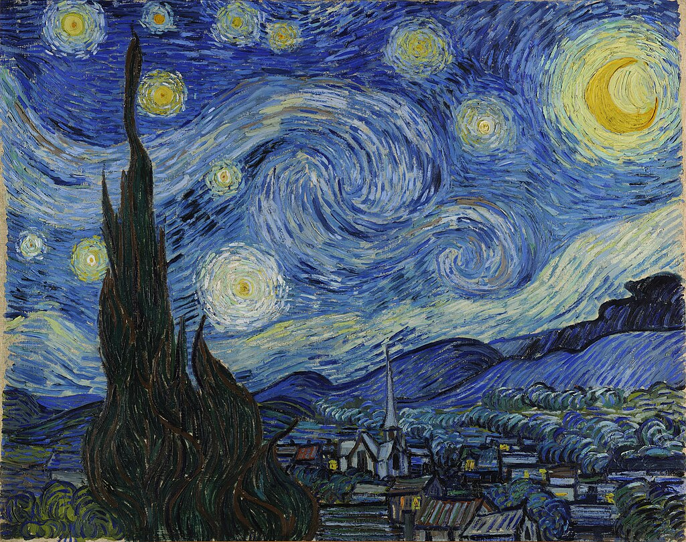

# DeepStyle: Neural Style Transfer Web App 🎨

A web application built with Python, TensorFlow, and Streamlit that uses deep learning to transfer the artistic style of one image onto the content of another.


## 🌟 About The Project

This project is an implementation of the famous "Neural Style Transfer" technique, first described in the paper ["A Neural Algorithm of Artistic Style"](https://arxiv.org/abs/1508.06576) by Gatys et al.

Instead of a simple script, **DeepStyle** provides an intuitive web interface where users can:
* Upload their own content image (e.g., a personal photo).
* Upload a style image (e.g., a famous painting).
* Generate a new, unique artwork that combines the two.

**Built With:**
* **TensorFlow / Keras:** For building and running the VGG19 model.
* **Streamlit:** For creating the interactive web application.
* **Pillow & NumPy:** For image processing and numerical operations.
* **Python 3.10**

---

## 🚀 Getting Started

Follow these instructions to get a copy of the project up and running on your local machine.

### Prerequisites

* Python 3.8+
* Git for cloning the repository.

### Installation

1.  **Clone the repository** to your local machine.
    ```sh
    git clone [https://github.com/your-username/deepstyle-webapp.git](https://github.com/your-username/deepstyle-webapp.git) cd deepstyle-webapp
    ```

2.  **Create and activate a virtual environment.**
    ```sh
    # For Windows
    python -m venv venv
    venv\Scripts\activate

    # For macOS/Linux
    python3 -m venv venv
    source venv/bin/activate
    ```

3.  **Install the required packages.**
    ```sh
    pip install -r requirements.txt
    ```

4.  **Run the Streamlit app.**
    ```sh
    streamlit run app.py
    ```
    Your web browser should automatically open to the application!

---

## 🖼️ Sample Results

Here is an example of an image generated by **DeepStyle**.

| Content & Style Images |
| :---: |
| |
| <table><tr><td><b>Content</b></td><td><b>Style</b></td></tr><tr><td></td><td></td></tr></table> |
| **DeepStyle Result** |
|  |

---

## 📜 License

Distributed under the MIT License. See `LICENSE` for more information.

---

## 🙏 Acknowledgments

* The original paper by Gatys, Ecker, and Bethge.
* The powerful and easy-to-use Streamlit library.
* The pre-trained VGG19 model provided by the Keras team.

````
